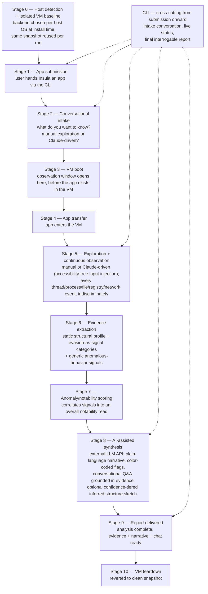

# Insula — Architecture

This document turns the five principles in `PROJECT.md` into an ordered,
concrete pipeline. Where a stage depends on something not yet decided (which
hypervisor, how the decoy is generated, how delayed-trigger evasion is
handled), it's flagged and pointed at the matching entry in
`OPEN_QUESTIONS.md` rather than re-litigated here.

## Pipeline overview

## Stage 0 — Host detection & isolated VM baseline

Not part of the per-run flow. Installation begins by detecting the host OS,
since that choice determines both the virtualization backend and the guest
OS everything downstream depends on. The guest is chosen to **mirror** the
host, not just to be lightweight in isolation — a Linux host gets a Linux
guest via KVM/Firecracker-style microVM tooling, a macOS host gets a macOS
guest via Apple `Virtualization.framework`. This matters because a
mismatched guest (e.g. analyzing a macOS-targeted app inside a Linux VM)
produces misleadingly incomplete results — the app simply doesn't run the
way it would on the real target. `ROADMAP.md`'s v1 scope covers both the
Linux-host and macOS-host paths; Windows, as either host or guest, is
deferred to v2.

Once the backend is selected, the isolated VM baseline is provisioned once
and periodically refreshed thereafter. Every run reuses this same ready
snapshot rather than building one from scratch under time pressure.

Produces the "populated but empty" environment described in `PROJECT.md`
principle 1: same folder structure and installed-application set as the
real device, no real data, no signed-in accounts anywhere. **How** this
baseline is generated and kept convincing is still open — see
`OPEN_QUESTIONS.md` §1.

**Disk footprint is not "the real machine, doubled."** The mimicry is
structural only — decoy files are empty/placeholder by design — and VM disk
images use sparse, thin-provisioned formats (e.g. QEMU's `qcow2`) with each
run working through a copy-on-write overlay on top of the Stage 0 baseline,
discarded after teardown. The one real, fixed cost is the guest OS
installation itself, not something that scales with the user's personal
storage.

## Stage 1 — App submission

The user hands Insula an app they want to understand, directly through the
CLI. The exact submission mechanic — a file path passed as a CLI argument,
an interactive file picker inside the running CLI, drag-and-drop into the
terminal — isn't decided yet; see `OPEN_QUESTIONS.md` §8.

## Stage 2 — Conversational intake

Before the app ever reaches the VM, Insula asks the user what they
actually want to know. If the goal is pure curiosity about the app's
on-device behavior rather than deep reverse engineering, Insula explains
that the user has full manual control to explore the app themselves once
it's running. Either way, the user chooses the exploration mode for
Stage 5:

- **Manual** — the user interacts with the app inside the VM directly.
- **Claude-driven** — Claude actively explores the app: reading the guest's
  accessibility tree to know what's on screen and clickable, injecting
  synthetic input to navigate menus/settings/features, falling back to
  screenshot-based vision where an app doesn't expose a usable
  accessibility tree. This exists to exercise meaningfully more of the
  app's behavior than a single incidental manual session would, at the
  cost of the API calls this consumes — which is exactly why it's an
  explicit user choice, not the automatic default for every run.

## Stage 3 — VM boot

The VM starts from the Stage 0 baseline snapshot. This is where the
observation window actually opens — **before** the app exists inside the
VM at all, so the full lifecycle from a clean boot onward is on the record.

## Stage 4 — App transfer

The app is moved into the running VM. Nothing else about the VM's
environment changes at this point.

## Stage 5 — Exploration + continuous observation

Whichever exploration mode Stage 2 selected runs here — the user driving
the app manually, or Claude driving it via accessibility-guided input
injection — while observation proceeds identically underneath either mode:
every thread the app spawns, every process it touches, every
filesystem/registry/network interaction within the VM is logged in full,
without pre-filtering for relevance, including anything that happens before
the app is ever explicitly launched.

The mechanism for capturing this — an in-guest sensor streaming events out,
versus true out-of-guest hypervisor-level introspection — is a real
implementation decision. `PROJECT.md` principle 4 commits to the observer
being unobservable from inside the guest as the design goal; which concrete
approach gets there for v1 is tracked in `OPEN_QUESTIONS.md` §3 alongside
the hypervisor choice.

## Stage 6 — Evidence extraction

Raw events from Stage 5, plus a static pass over the app itself, are turned
into the evidence set `PROJECT.md`'s "What the output looks like" section
describes:

- **Static structural profile** — imported libraries/APIs, embedded
  strings, signing/entitlement info, section entropy. This is a direct
  extension of what Milestone 1's static profiling engine already extracts
  (`src/`, e.g. entropy/string analysis, signature checks, file-type
  classification) — the same signal categories, feeding the evidence
  report.
- **Evasion checks** — probing for VM/sandbox artifacts.
- **Irrelevant enumeration** — touching software/files with no logical
  connection to the app's stated purpose.
- **Temporal / execution-count fingerprinting** — querying elapsed uptime
  or self-run-count with no functional reason to.
- **Generic anomalous-behavior signals** — mass file modification, outbound
  connections to unusual destinations, process injection, persistence
  mechanisms, credential access attempts.

Each signal is emitted as a discrete, timestamped record — this stage does
not itself decide notability, it identifies and categorizes.

## Stage 7 — Anomaly/notability scoring

Correlates the signals from Stage 6 into an overall notability read for the
report — what's worth the user's attention versus routine. No single
signal is meaningful on its own — this stage is where the "broad,
purpose-mismatched probing" judgment actually gets made, weighing
combinations and context rather than triggering on isolated events.

## Stage 8 — AI-assisted synthesis

The full timestamped log, the Stage 6 evidence set, and the Stage 7
notability read are sent to an external LLM API (`PROJECT.md`'s one
deliberate exception to avoiding external dependencies) to produce:

- A plain-language narrative of what the app actually did.
- Color-coded distinction between routine and notable actions in the final
  report.
- A conversational layer the user can question after the fact, with
  answers grounded in the actual recorded evidence.
- Optionally, if the user consented during Stage 2 (or requests it here),
  an **inferred structure sketch** — confidence-tiered per `PROJECT.md`'s
  "Core concept": narrow, actually-verified mechanisms marked with higher
  confidence than the broader narrative sketch, which is explicitly labeled
  as reflecting only the paths that were actually exercised.

## Stage 9 — Report delivered

The analysis is complete: the evidence set, the AI narrative, and the
conversational layer are ready in the CLI. There is no release/block
decision here — Insula's job is understanding, not gatekeeping what the
user does with an app that's already theirs.

## Stage 10 — VM teardown

The VM is reverted to its clean baseline snapshot unconditionally
(`PROJECT.md`'s safety guarantees). Nothing carries over between runs.

## CLI — cross-cutting from submission onward

The CLI is the entry point — Stage 1 happens inside it — and stays the
surface for everything that follows: the Stage 2 intake conversation, live
status while Stages 3–8 run, and the final, questionable report at Stage 9.

## What this document deliberately leaves open

Four things are referenced above but not decided here, because they belong
in `OPEN_QUESTIONS.md` and shouldn't be settled as a side effect of drawing
the pipeline: the decoy generation method (§1), delayed-trigger mitigation
specifics (§2), the hypervisor/VM tooling choice (§3), and the guest OS
image (§4). The task breakdown that follows this document will surface
where each of those needs to be resolved before implementation can proceed
past that point.
